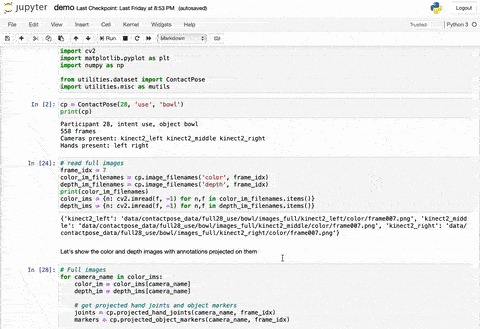

# ContactPose Documentation

## Table of Contents
- [Getting Started](#getting-started)
- [Demo Jupyter Notebook](#demo-notebook)
- [Downloading Data](#downloading-data)
- [Object and Hand depth maps and masks](#object-and-hand-depth-maps-and-masks)
- [3D Models and 3D Printing](#3d-models-and-3d-printing)
- [Data Analysis](#data-analysis)
- [Miscellaneous](#miscellaneous)

# Getting Started

1. Install [Miniconda](https://docs.conda.io/en/latest/miniconda.html). Create the `contactpose` conda environment:
`conda env create -f environment.yml`. Activate it:
```bash
$ conda activate contactpose
```
The following commands should be run after activating the conda env.

2. Startup by downloading grasp data (pose annotations and camera calibrations) for the entire dataset,
contact maps for participant \#28 all 'use' intent grasps, and RGB-D images for
participant \#28 'bowl' object, 'use' intent grasp. By default it will
download to `data/contactpose_data`, but you can also provide a directory of
your choice. It will symlink that directory to `data/contactpose_data` for easy access. 

```bash
$ python startup.py --data_dir <dir_name>
ContactPose data directory is data/contactpose_data
Downloading 3D model marker locations...
100%|███████████████████████████████████████████████████████████████████████████████████████████████████████████████████████████████████████████| 103k/103k [00:05<00:00, 17.3kiB/s]
Extracting...
Downloading grasps...
100%|████████████████████████████████████████████████████████████████████████████████████████████████████████████████████████████████████████████| 126M/126M [03:45<00:00, 559kiB/s]
Extracting...
100%|█████████████████████████████████████████████████████████████████████████████████████████████████████████████████████████████████████████████| 100/100 [01:55<00:00,  1.15s/it]
Downloading full28_use contact maps...
100%|█████████████████████████████████████████████████████████████████████████████████████████████████████████████████████████████████████████| 96.8M/96.8M [00:03<00:00, 29.1MiB/s]
Extracting...
Downloading full28_use images...
  0%|                                                                                                                                                         | 0/1 [00:00<?, ?it/s]bowl
100%|█████████████████████████████████████████████████████████████████████████████████████████████████████████████████████████████████████████| 2.08G/2.08G [00:45<00:00, 45.6MiB/s]
100%|█████████████████████████████████████████████████████████████████████████████████████████████████████████████████████████████████████████████████| 1/1 [00:47<00:00, 47.23s/it]
Extracting...
1it [00:33, 33.48s/it]
```

3. Download MANO code and models from [https://mano.is.tue.mpg.de](https://mano.is.tue.mpg.de)
and unzip it in to `thirdparty/mano`. **Note**: MANO code is written for Python 2,
but we use it in Python 3. We have developed work-arounds for all issue except one:
you should comment out the `print 'FINITO'` (last line) statement in
`thirdparty/mano/webuser/smpl_handpca_wrapper_HAND_only.py`. MPI license does 
not allow re-distribution of their MANO code.

4. You can 3D visualize contact maps and 3D hand joints:
```bash
$ python scripts/show_contactmap.py --p_num 28 --intent use --object_name mouse --mode simple_hands
```

`simple_hands` mode


`semantic_hands_fingers` mode


`semantic_hands_phalanges` mode


`simple_mano` mode


# [Demo notebook](demo.ipynb)
Jupyter notebook demonstrating the ContactPose dataset API - accessing images, poses, and calibration data.



# Downloading Data

All downloads can be done through `scripts/download_data.py`:
```bash
$ python scripts/download_data.py --help
usage: download_data.py [-h] --type {grasps,images,contact_maps,markers,3Dmodels}
                        [--p_nums P_NUMS] [--intents INTENTS]
                        [--images_dload_dir IMAGES_DLOAD_DIR]

optional arguments:
  -h, --help            show this help message and exit
  --type {grasps,images,contact_maps}
  --p_nums P_NUMS       Participant numbers E.g. 1, 1,2, or 1-5
  --intents INTENTS     use, handoff, or use,handoff
  --images_dload_dir IMAGES_DLOAD_DIR
                        Directory where images will be downloaded.They will be
                        symlinked to the appropriate location
```

You can download more contact maps:

```bash
$ python scripts/download_data.py --p_nums 1-10 --intents use,handoff --type contact_maps
```

And more RGB-D images:

```bash
$ python scripts/download_data.py --p_nums 1-10 --intents use,handoff --type images \
--images_dload_dir <dir_name>
```

The entire RGB-D collection is ~ 2.5 TB. Hence the script provides the option to
provide an image download directory. This can be on a large SSD drive, for example.
It will automatically symlink the downloaded data to the appropriate location
in `data/contactpose_data` for easy access. The image download directory defaults
to `data/contactpose_data`.

3D models of objects and locations of markers placed on them (this is already
done if you run `startup.py`):

```bash
$ python scripts/download_data.py --type 3Dmodels
$ python scripts/download_data.py --type markers
```

All grasp information - 3D joints, MANO fits, camera calibrations - (this is already
done if you run `startup.py`):

```bash
$ python scripts/download_data.py --type grasps
```

# [Object and Hand Depth Maps and Masks](rendering.md)

# 3D Models and 3D Printing
[STL files](https://www.dropbox.com/sh/g1nv595mvhnnxoi/AACEF0x4Hj22MctIpzFCkIVCa?dl=1) | 
[STL files with cylindrical recesses for markers](https://www.dropbox.com/sh/m14c4u2yr029f8k/AAA1yGl-k_4XEXElfmCgF1Fpa?dl=1) |
[High-poly PLY files](https://www.dropbox.com/sh/l76a01eyx6sxoll/AACrvU_QYRG8A8pevM1QPCs9a?dl=1)

The cylindrical recesses were produced using [this script](). Please see
[this README](https://github.com/samarth-robo/contactdb_utils#3d-printing)
for more details about 3D printing the objects.

# [Data Analysis](data_analysis.md)

# Miscellaneous
## 21 Joint Format 
The ordering and placement of joints follows the
[OpenPose format](https://github.com/CMU-Perceptual-Computing-Lab/openpose/blob/master/doc/output.md#hand-output-format).
In 3D, the joints are at the center of the finger-cylinders, not on the surface.
The functions `mano2openpose()` and `mano_joints_with_fingertips()` in `utilities/misc.py`
convert the joints from the MANO model to this format. For example, see how 
they are used in `load_mano_meshes()`.

## Transform Tree
Transform matrices are consistently named in the code according to the 
following transform tree. For example, `oTh` is the pose of the hand w.r.t.
the object.
```
world
|
|----wTc----camera
|
|----wTo----object
            |
            |----oTh----hand
                        |
                        |----hTm----MANO
```
Other matrices can be composed. For example, the pose of an object in the camera
coordinate frame `cTo = inv(wTc) * wTo`. This naming convention, explained in
[this blog post](https://gtsam.org/gtsam.org/2020/06/28/gtsam-conventions.html)
makes keeping track of 3D transforms easier.
