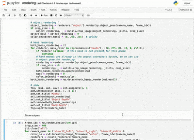

# Rendering and Masking Operations
These operations allow you to render depth maps of the object and hand in each image. You can then derive masks by thresholding the depth images.

## Setup
It is important to install pyrender within the `contactpose` conda environment. In our experience pyrender headless rendering works only in Linux. The following instructions are adapted from the [official installation guide](https://pyrender.readthedocs.io/en/latest/install/index.html).

- Build OSMesa from source and install to the `contactpose` conda env:
```bash
$ conda activate contactpose
(contactpose) $ sudo apt-get install llvm-6.0 freeglut3 freeglut3-dev
(contactpose) $ cd ~/Downloads && wget ftp://ftp.freedesktop.org/pub/mesa/mesa-18.3.3.tar.gz
(contactpose) $ tar xfv mesa-18.3.3.tar.gz
(contactpose) $ cd mesa-18.3.3
(contactpose) $ ./configure --prefix=${CONDA_PREFIX}          \
            --enable-opengl --disable-gles1 --disable-gles2   \
            --disable-va --disable-xvmc --disable-vdpau       \
            --enable-shared-glapi                             \
            --disable-texture-float                           \
            --enable-gallium-llvm --enable-llvm-shared-libs   \
            --with-gallium-drivers=swrast,swr                 \
            --disable-dri --with-dri-drivers=                 \
            --disable-egl --with-egl-platforms= --disable-gbm \
            --disable-glx                                     \
            --disable-osmesa --enable-gallium-osmesa          \
            ac_cv_path_LLVM_CONFIG=llvm-config-6.0
(contactpose) $ make -j8
(contactpose) $ make install
```

- Set some environment variables to be loaded when the conda env is activated
(instructions from
[here](https://docs.conda.io/projects/conda/en/latest/user-guide/tasks/manage-environments.html#saving-environment-variables)):
```bash
(contactpose) $ cd $CONDA_PREFIX
(contactpose) $ mkdir -p ./etc/conda/activate.d
(contactpose) $ mkdir -p ./etc/conda/deactivate.d
(contactpose) $ touch ./etc/conda/activate.d/env_vars.sh
(contactpose) $ touch ./etc/conda/deactivate.d/env_vars.sh
```

Edit `./etc/conda/activate.d/env_vars.sh` as follows:
```
#!/bin/sh

export OLD_LIBRARY_PATH=$LIBRARY_PATH
export OLD_LD_LIBRARY_PATH=$LD_LIBRARY_PATH
export OLD_C_INCLUDE_PATH=$C_INCLUDE_PATH
export OLD_CPLUS_INCLUDE_PATH=$CPLUS_INCLUDE_PATH

MESA_HOME=$CONDA_PREFIX
export LIBRARY_PATH=$LIBRARY_PATH:$MESA_HOME/lib
export LD_LIBRARY_PATH=$LD_LIBRARY_PATH:$MESA_HOME/lib
export C_INCLUDE_PATH=$C_INCLUDE_PATH:$MESA_HOME/include
export CPLUS_INCLUDE_PATH=$CPLUS_INCLUDE_PATH:$MESA_HOME/include
```

Edit `./etc/conda/deactivate.d/env_vars.sh` as follows:
```
!/bin/sh

export LIBRARY_PATH=$OLD_LIBRARY_PATH
export LD_LIBRARY_PATH=$OLD_LD_LIBRARY_PATH
export C_INCLUDE_PATH=$OLD_C_INCLUDE_PATH
export CPLUS_INCLUDE_PATH=$OLD_CPLUS_INCLUDE_PATH

unset OLD_LIBRARY_PATH
unset OLD_LD_LIBRARY_PATH
unset OLD_C_INCLUDE_PATH
unset OLD_CPLUS_INCLUDE_PATH
```

- Install a compatible fork of PyOpenGL:
```bash
(contactpose) $ git clone git@github.com:mmatl/pyopengl.git
(contactpose) $ pip install ./pyopengl
```

- Finally, install `pyrender`:
```bash
(contactpose) $ pip install pyrender
```


## [Demo Notebook](../rendering.ipynb)
